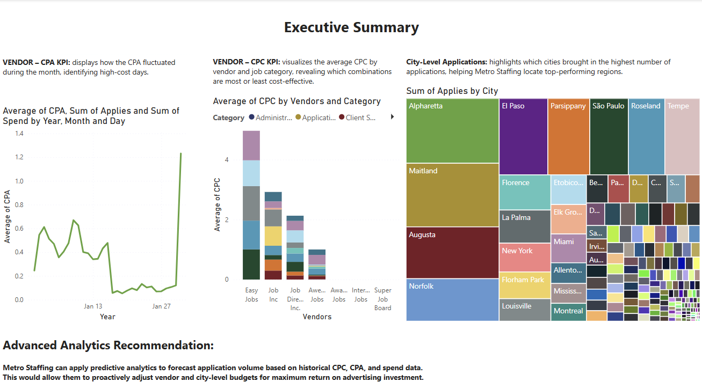

# 🔷 Capstone-style BI Project – Out of the Box Analytics (Power BI)

# 📊 Out of the Box Analytics – Power BI Project

This project was developed as part of the **"Out of the Box Analytics"** challenge, focused on helping **Metro Staffing Inc.** optimize their monthly job ad spend using data-driven decision-making.

## 🎯 Project Objectives

- Analyze vendor, CPC, CPA, and location-based metrics from job ad data
- Visualize and evaluate advertising performance using Power BI
- Recommend cost-saving strategies and smarter spend allocation
- Propose an advanced analytics solution based on available data

---

## 📁 Project Deliverables

- **Power BI Workbook** `OutOfTheBoxAnalytics_Alwaleed.pbix`
  - 3 KPI Tabs:
    - Vendor CPA Performance
    - Vendor/Category CPC Efficiency
    - Applications by City
  - Executive Summary Tab:
    - Visual summary from each KPI
    - Advanced Analytics recommendation (predictive model)

---

## 📈 Key Features

- Clean, filtered visual dashboards using:
  - Line chart, stacked column, tree map, KPI cards, and bar chart
- Advanced filtering using slicers (Category, City)
- Custom DAX Measures:
  - `Applications Per SAR`
- Best practice applied:
  - `_not_specified_` filtered from insights

---

## 🧠 Advanced Analytics Recommendation

Metro Staffing can apply **predictive analytics** to forecast future application volumes by vendor and city using historical CPC, CPA, and spend data. This would allow proactive budget reallocation to maximize ROI and performance.

---

## 🔧 Tools & Tech

- Power BI Desktop  
- DAX  
- Data Visualization Principles  
- GitHub for version control and publication

---

## 👤 Author

**Alwaleed Alkhudairi**  
📍 Riyadh, Saudi Arabia  
💼 **Senior Data Analyst at GASTAT**  
🔗 [LinkedIn](https://www.linkedin.com/in/alwaleed-alkhdairi)  
📂 [Portfolio GitHub](https://github.com/AlwaleedAlkhdairi)

---

> 💬 Feel free to fork or explore this repo to learn how data analytics drives better decisions in government and staffing operations.
